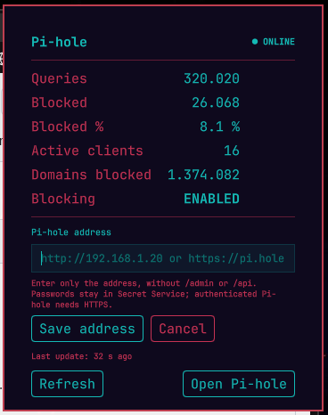

# OmaPiHole

Read-only Pi-hole v6 status for the Omarchy bar. Part of the **OmaOps** plugin family.

**Version: 0.1.0** · Maintainer: [danielfuentespl](https://github.com/danielfuentespl)

OmaPiHole is an independent third-party project and is not affiliated with or endorsed by Pi-hole.



## Features

- Native bar icon and panel with Pi-hole health and DNS blocking status.
- Queries, blocked queries, blocked percentage, active clients and gravity domains.
- Shared polling service for multiple bars; no enable/disable-blocking action.
- Pi-hole v6 Application Password authentication through Secret Service.
- Read-only access to the Pi-hole API; API requests never follow redirects.
- Configuration, authentication, network, timeout and stale-data states.

## Requirements

- Plugin-capable Omarchy Quattro. The maintainer's original manual test used Omarchy 4.0.4 and Quickshell 0.3.1 with a real Pi-hole v6.
- Pi-hole v6; Pi-hole v5 is not supported.
- `curl` and `secret-tool` (`libsecret`) plus an available Secret Service keyring for authenticated instances. `curl` is required for all API requests.
- Development tests require Node.js and Python 3; these are not plugin runtime dependencies.

The v0.1.0 release has automated regression coverage and was manually validated on Omarchy 4.0.4 / Quickshell 0.3.1 against a real Pi-hole v6, including HTTPS with a custom CA and Pi-hole Application Password authentication through Secret Service. Remaining limitations and validation notes are documented in [development notes](docs/DEVELOPMENT.md).

## Installation

Install from the public GitHub repository:

```bash
omarchy plugin add https://github.com/danielfuentespl/omarchy-pihole.git --enable
```

Choose the bar section when prompted. The plugin ID is `com.blogvirtualizado.omaops.pihole`.

## Configuration

Open the bar/widget configuration in Omarchy and edit the OmaPiHole settings. Set **Pi-hole base URL** to the HTTP(S) origin of your instance, for example:

```text
https://pi.hole
```

An optional port and one trailing slash are accepted. Do **not** include `/admin`, `/api`, any other path, username/password, query or fragment. IPv6 addresses must be enclosed in brackets. Credentials never belong in this setting.

| Setting | Default | Purpose |
| --- | --- | --- |
| baseUrl | empty | Pi-hole origin |
| refreshIntervalSec | 60 | Poll interval, 30–3600 seconds |
| staleAfterSec | 180 | Data age threshold, 60–7200 seconds |
| requestTimeoutMs | 5000 | Total timeout for each API request and keyring lookup, 1000–30000 ms |
| secretId | default | Secret Service entry ID for the Pi-hole Application Password |
| caCertPath | empty | Optional absolute path to a PEM CA bundle; uses this bundle for TLS verification |

Keep the stale threshold above your polling interval unless you intentionally want stale indications between polls.

### HTTP and HTTPS

HTTP does not encrypt API statistics. Pi-hole without API authentication may use HTTP. If a request returns 401, OmaPiHole refuses to retrieve or send credentials over HTTP; configure HTTPS instead.

HTTPS requires a certificate trusted by curl's normal CA store and valid for the configured hostname. A private CA or self-signed certificate can be trusted by the operating system using its normal certificate-management mechanism. Alternatively, set **Custom CA certificate file** to an absolute PEM CA-bundle path; when set, curl uses that bundle to verify the peer. No trust store is modified or certificate installed by OmaPiHole. Certificate verification is never disabled.

### Authentication

Pi-hole v6 uses an **Application Password** in `POST /api/auth`, then a session ID in `X-FTL-SID`. OmaPiHole retrieves the Application Password only after a 401, using **Secret ID** to select its Secret Service entry. From the installed plugin directory, run:

```bash
cd ~/.config/omarchy/plugins/com.blogvirtualizado.omaops.pihole
./scripts/store-secret
```

The helper prompts without echo and sends the value to Secret Service on stdin. It contains no password itself. Choose another keyring entry with `./scripts/store-secret secondary` and set the widget's **Secret ID** to the same value. Use HTTPS for authenticated Pi-hole instances. The password is not in plugin settings, `manifest.json`, argv, environment variables or plugin files. Secret Service persists it in the user's keyring until that entry is removed. JavaScript/Qt strings are released after use; cryptographic memory erasure is not promised.

OmaPiHole NEVER follows HTTP redirects for API requests that could contain credentials. Any 3xx response fails with “Redirect refused. Configure the canonical Pi-hole URL.” Configure the canonical Pi-hole origin directly. Pi-hole Application Password is distinct from reverse-proxy Basic Auth; proxy Basic Auth is not supported in v0.1.0.

## Panel

Click the bar icon to open the panel. **Refresh** or **R** requests new data; **Open Pi-hole** opens the configured origin's `/admin/` page. Refresh is temporarily unavailable while a cycle runs.

Metrics are `—` and blocking is `UNKNOWN` until a complete valid response is available. On subsequent failure, previous metrics remain visible with **Previous data** and their last update time. Changing the server discards those metrics.

Queries and blocking metrics come from `/api/stats/summary` (the current statistics window, normally the last 24 hours), not the long-term database endpoint. Active clients are those seen in the last 24 hours; gravity domains are the current gravity-list count.

States: `ONLINE`, `BLOCKING DISABLED`, `OFFLINE`, `STALE`, `AUTH REQUIRED`, `NOT CONFIGURED`, `ERROR`. Blocking disabled is a warning, not proof that the server is offline.

## Update, enable, disable and remove

```bash
omarchy plugin update com.blogvirtualizado.omaops.pihole
omarchy plugin disable com.blogvirtualizado.omaops.pihole
omarchy plugin enable com.blogvirtualizado.omaops.pihole
omarchy plugin remove com.blogvirtualizado.omaops.pihole
```

Removing the plugin does **not** automatically remove the Application Password from Secret Service. To remove an entry deliberately, run `secret-tool clear application omaops-pihole instance default`, replacing `default` with the Secret ID. Revocation of an Application Password is managed in Pi-hole.

## Troubleshooting

- **NOT CONFIGURED:** supply an origin in the accepted format, without `/admin` or `/api`.
- **AUTH REQUIRED:** check the Application Password, Secret ID and unlocked keyring. Credentials require HTTPS.
- **curl is required:** install curl; OmaPiHole does not install dependencies automatically.
- **secret-tool is required:** install `libsecret` and ensure Secret Service is running in the user session.
- **OFFLINE:** check DNS, routing and Pi-hole availability. Common curl DNS, connection, timeout and certificate-verification failures are distinguished.
- **ERROR:** an HTTP failure or malformed/unexpected API response was received. Check compatibility with Pi-hole v6.
- **STALE / Previous data:** displayed metrics are old; inspect the error and last update time.
- After QML development edits, a shell restart may be needed if the installed shell does not reload the service. Multi-monitor lifecycle remains part of ongoing validation.

## Security

Operations are tied to a configuration generation, origin and Secret ID. Changing the URL, Secret ID or custom CA path cancels pending work and clears SID and secret references. See [security notes](docs/SECURITY.md).

## Development

```bash
./tests/run
omarchy plugin validate .
```

The suite covers models, manifest and service functions with simulated transport/processes. It does not replace QML, TLS or real-instance runtime tests. See [validation status](docs/DEVELOPMENT.md).


## Compatibility and transport support

| Scenario | Support |
| --- | --- |
| Pi-hole without API auth | SUPPORTED |
| Pi-hole Application Password | SUPPORTED |
| HTTP without credentials | SUPPORTED |
| HTTP with credentials | REJECTED |
| HTTPS public CA | SUPPORTED |
| HTTPS private CA trusted by OS | SUPPORTED |
| Self-signed trusted by OS | SUPPORTED |
| Custom CA file | SUPPORTED |
| Untrusted certificate | REJECTED |
| TLS bypass | NOT SUPPORTED |
| Reverse proxy Basic Auth | NOT SUPPORTED |
| mTLS | NOT SUPPORTED |

The curl transport receives request configuration over stdin, uses `curl -q --config -`, and never enables redirect following. A loopback test covered 301, 302, 303, 307 and 308 with a malicious `~/.curlrc`; the redirect sink received zero requests. TLS verification remains enabled. See [development validation](docs/DEVELOPMENT.md) for automated and runtime coverage.

## License and icon

Project code: [MIT](LICENSE). The Pi-hole icon uses Simple Icons geometry under CC0-1.0, with the Pi-hole brand color applied. Pi-hole retains its trademark rights. See [asset provenance](assets/README.md).
